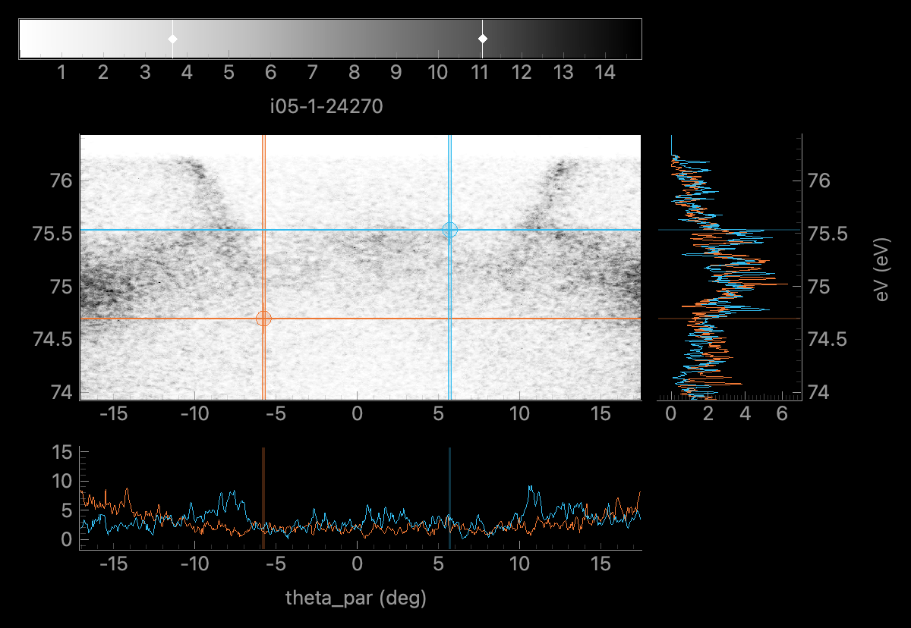

# Lewis Hart, PhD - Portfolio

Scientist with a background of data analysis and PhD in physics. Skilled in transforming complex data sets and communicating the results to audiences with varying technical expertise. Highly motivated to employ statistical algorithms whilst utilizing the rapid advancements in machine learning.

## Key Skills
Some of the technologies I have used regularly:  
  

## Projects
Below are some examples of my work:

- ### Python Electron Spectroscopy Analysis by King Group St Andrews - peaks
  Contributed to the development of open-source software that is a python package for analysis of angle-resolved photoemission and related spectroscopies.  
  https://github.com/phrgab/peaks   
  
   

- ### Raman Spectroscopy Classification  
  Classification model using Conv1D to identify ReS₂ and ReSe₂ from Raman spectra using **TensorFlow** and **Keras**.  
  https://github.com/lsh-cloud/Neural-network-Raman-spectroscopy
    

- ### AI Agent  
  An AI agent built using **Azure OpenAI API** and **LangGraph** that can decide whether to answer a question using its own knowledge or from a user uploaded PDF.  
  https://github.com/lsh-cloud/PDF-reading-QA-assistant/tree/main
    
