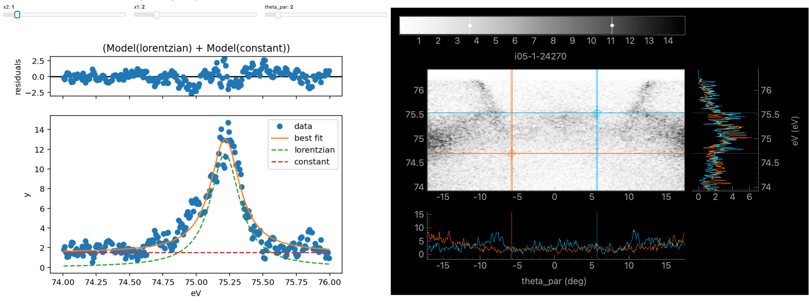
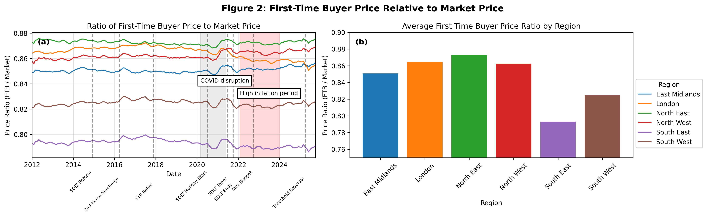
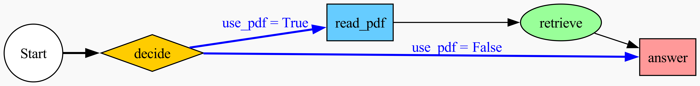
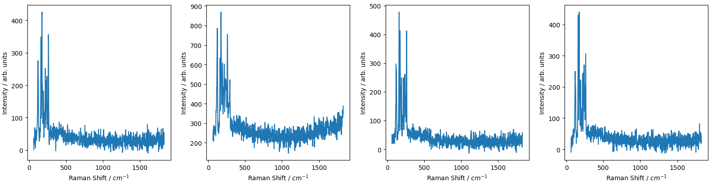
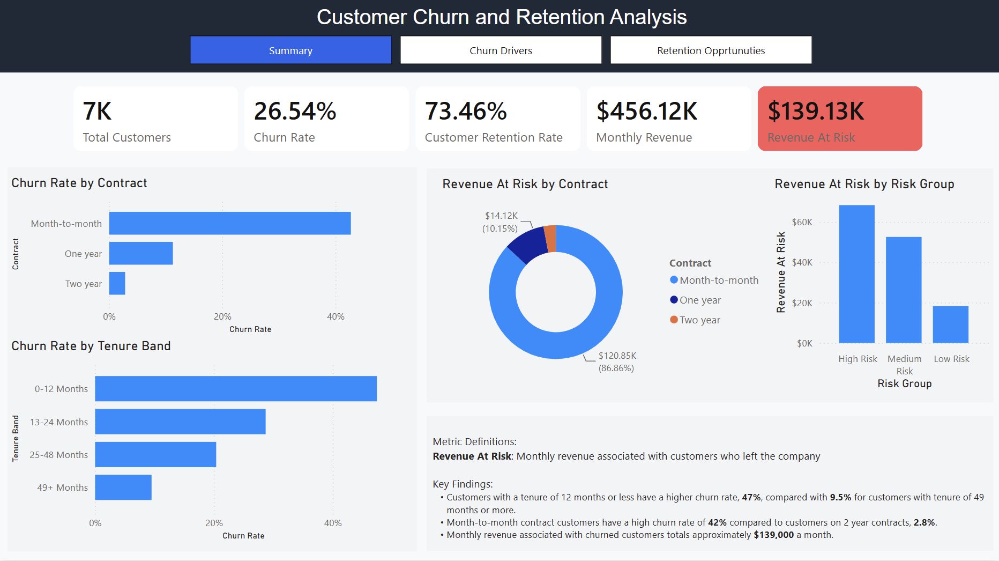

  

## Table of Contents
- [Profile](#profile)
- [Key Achievements](#key-achievements)
- [Key Skills](#key-skills)
- [Projects](#projects)
- [Certificates](#certificates)   

## Profile 
   
- Scientist with a background in data analysis and a PhD in physics. Skilled in transforming complex data sets and communicating the results to audiences with varying technical expertise. Highly motivated to employ statistical algorithms whilst utilising the rapid advancements in machine learning.
- LinkedIn: https://www.linkedin.com/in/lewis-hart-phd
- Google Scholar: https://scholar.google.co.uk/citations?user=_iBiShUAAAAJ&hl=en&oi=ao

## Key Achievements 
- Published **8 peer-reviewed papers** with more than **390 citations** (h-index: 7, i10-index: 7).  
- Most cited first-author paper: **132 citations**
- Organised a national conference on computational and experimental materials science, attended by approximately **130** participants. 
  
## Key Skills 
Some of the technologies I have used regularly:  

## Projects 
Below are some examples of my work:
  
- ### Python Electron Spectroscopy Analysis by King Group St Andrews - peaks   
  - Open-source software that is a Python package for analysis of angle-resolved photoemission and related spectroscopies.
  - Photoemission spectroscopy is carried out at synchrotron facilities and university laboratories, but differences in data formats and experimental geometries can make analysis challenging. This software provides a unified pipeline that standardises data formatting across synchrotron sources, ensuring consistency and simplifying analysis.
  - I contributed to the development of the original "PyPhoto" project, which was later restructured into "peaks". My role included helping design the concept, careful consideration of how to standardise the pipeline, troubleshooting and bug fixes.
  - Code: https://github.com/phrgab/peaks
  - Documentation: https://research.st-andrews.ac.uk/kinggroup/peaks
  - Publication: https://doi.org/10.48550/arXiv.2508.04803
 

- ### Exploring UK Housing Market Trends: An SQL-Based Analysis of First-Time Buyer Positioning
   - Analysis of UK housing market trends using **SQL**, **Python** and **GIS**, combining ONS House Price Index and CPI data.
   - The analysis shows that inflation-adjusted house prices have remained relatively flat since 2012, while first-time buyers consistently operate in a lower-price segment (~79–88% of market prices).
   -  Code: https://github.com/lsh-cloud/SQL_House_Prices
     

- ### AI Agent  
  - An AI agent built using **Azure OpenAI API** and **LangGraph** that can decide whether to answer a question using its own knowledge or from a user-uploaded PDF.   
  - There are safety mechanisms incorporated to protect against prompt injection and **Azure Content Safety API** is used to prevent discussions including self harm, violence, hate or sexual content.
  - **IBM Granite Guardian** can be used to check input for dangerous language with the help of **Hugging Face** libraries
  - **Docker Support**: Includes a **Dockerfile** for easy containerisation and deployment with **Flask**.  
  - Code: https://github.com/lsh-cloud/PDF-reading-QA-assistant/tree/main
  

- ### Raman Spectroscopy Classification
   - This project demonstrates how deep learning can be applied to material identification using Raman spectroscopy data. The goal was to see if simulated one-dimensional Raman spectroscopy data can be classified using a neural network. 
  - Built a **Conv1D** neural network using **TensorFlow** and **Keras** to process 1D spectral data.  
  - Implemented custom data generators for efficient handling of Raman spectra.  
  - Applied hyperparameter tuning with Keras Tuner to optimise performance.  
  - Code: https://github.com/lsh-cloud/Neural-network-Raman-spectroscopy   
  

- ### AdventureWorks SQL & Machine Learning Analysis
   - This project demonstrates how to connect to and retrieve data from a relational database on the cloud platform, **Microsoft Azure**, using **SQL**.
   - This data is subsequently analysed using **machine learning algorithms** and Python visualisation techniques are used as a data storytelling tool.
   - Code: https://github.com/lsh-cloud/azure-sql-ml-demo
 
- ### Customer Retention Analysis
   - A project that uses **Power BI** to analyse customer churn, revenue at risk and customer retention strategies using the IBM Telco database. 
   - Customers on month-to-month contracts have a high churn rate of **42%**, whereas customers on two-year contracts have a low churn rate, **2.8%** therefore it is recommended that efforts are made to entice customers onto long-term contracts.
   -  Code: https://github.com/lsh-cloud/Customer-Retention-Intelligence
   

## Certificates 
- Microsoft Certified: Power BI Data Analyst Associate
- Microsoft Certified: Azure Fundamentals
- LinkedIn: Learning Google Cloud Developer and DevOps Tools
- Coursera: DeepLearning.AI TensorFlow Developer Specialization
- LinkedIn: Advanced SQL for Data Scientists
- LinkedIn: Deep Learning: Image Recognition
- LinkedIn: Machine Learning with Scikit-Learn
- LinkedIn: Programming Foundations: Version Control with Git
- Google: TensorFlow Developer Certificate
